# DIO - .NET Track - Database
www.dio.me

## Project Challenge
For this challenge, you will need to use the knowledge acquired in the database module of the DIO .NET track.

## Context
You are responsible for the database of a movie website, where data about movies and their actors are stored. Therefore, you were asked to perform a database query to bring some data for analysis.

## Proposal
You will need to perform 12 queries on the database, each returning a type of information.
Your database is modeled as follows:

The tables are described as follows:

**Filmes**

Table responsible for storing information about movies.

**Atores**

Table responsible for storing information about actors.

**Generos**

Table responsible for storing movie genres.

**ElencoFilme**

Table responsible for representing a many-to-many relationship between movies and actors, meaning an actor can work in many movies, and movies
can have many actors.

**FilmesGenero**

Table responsible for representing a many-to-many relationship between movies and genres, meaning a movie can have more than one genre, and a genre can be part of many movies.

## Preparing the database
You should execute the **Script Filmes.sql** file in your SQL Server database, located in the Scripts folder of this repository ([or click here](Script%20Filmes.sql)). This script will create a database called **Movies**, containing the necessary tables and data for you to complete this challenge.

## Objective
You will need to create several queries to return the following data. Below each request is the expected return. Your return must be the same as in the image.

## 1 - Fetch the name and year of the movies

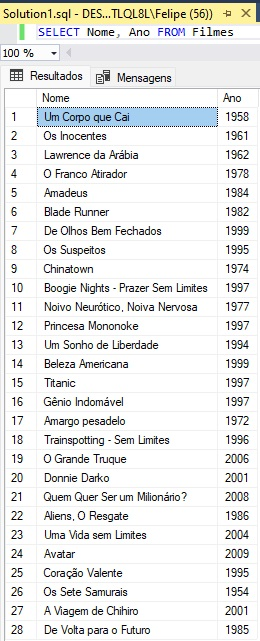

## 2 - Fetch the name and year of the movies, sorted in ascending order by year

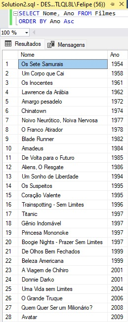

## 3 - Fetch the movie "Back to the Future," returning the name, year, and duration

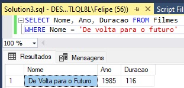

## 4 - Fetch the movies released in 1997

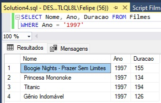

## 5 - Fetch the movies released AFTER the year 2000

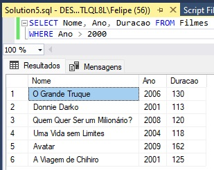

## 6 - Fetch the movies with a duration greater than 100 and less than 150, sorted by duration in ascending order

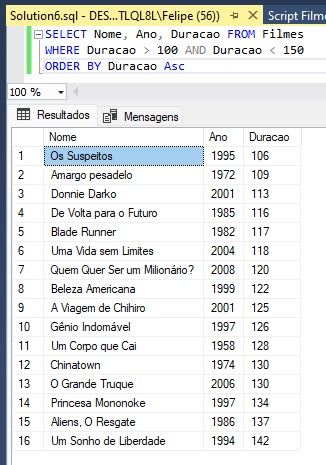

## 7 - Fetch the number of movies released in the year, grouping by year, sorting by duration in descending order

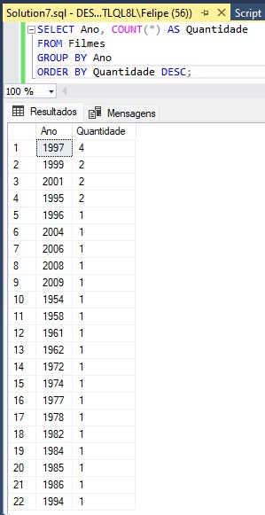

## 8 - Fetch male actors, returning FirstName, LastName

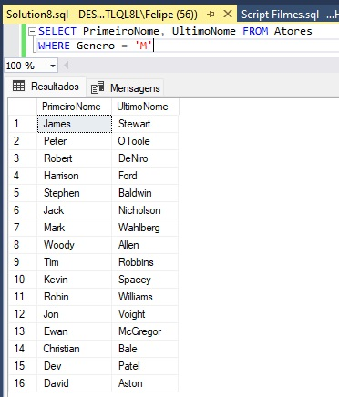

## 9 - Fetch female actors, returning FirstName, LastName, and sorting by FirstName

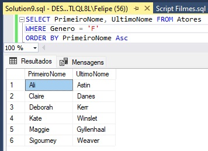

## 10 - Fetch the name of the movie and the genre

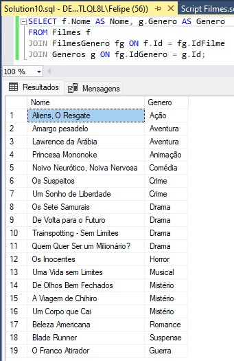

## 11 - Fetch the name of the movie and the genre of type "Mystery"

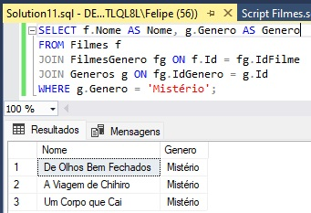

## 12 - Fetch the name of the movie and the actors, returning FirstName, LastName, and their Role

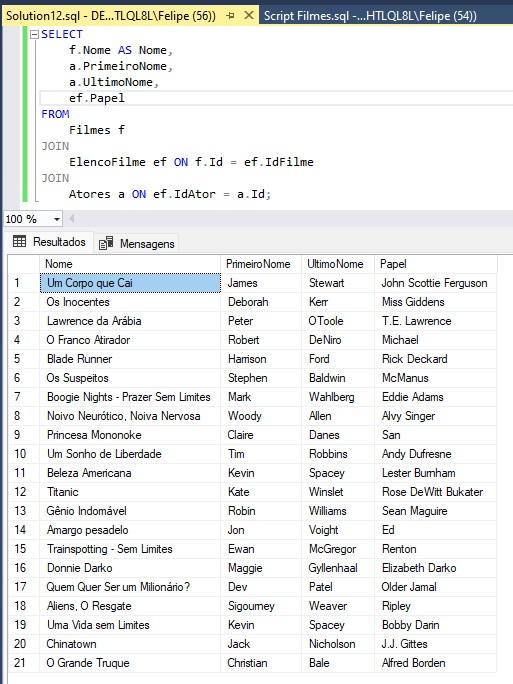
